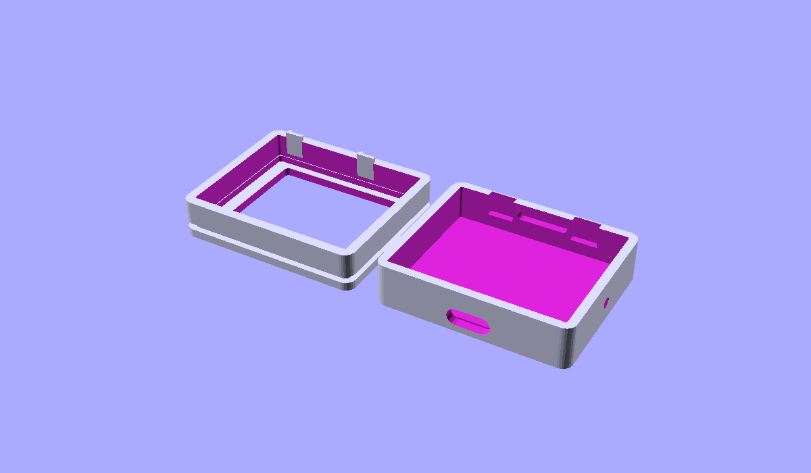
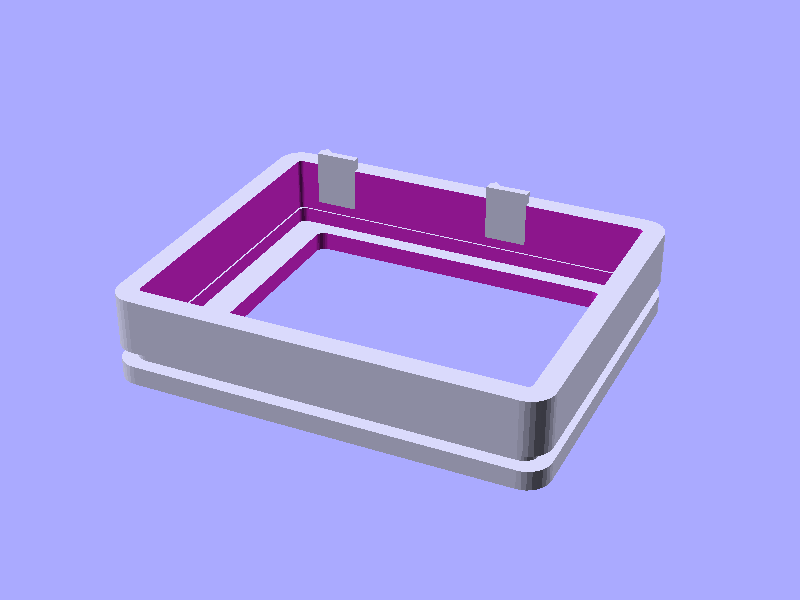
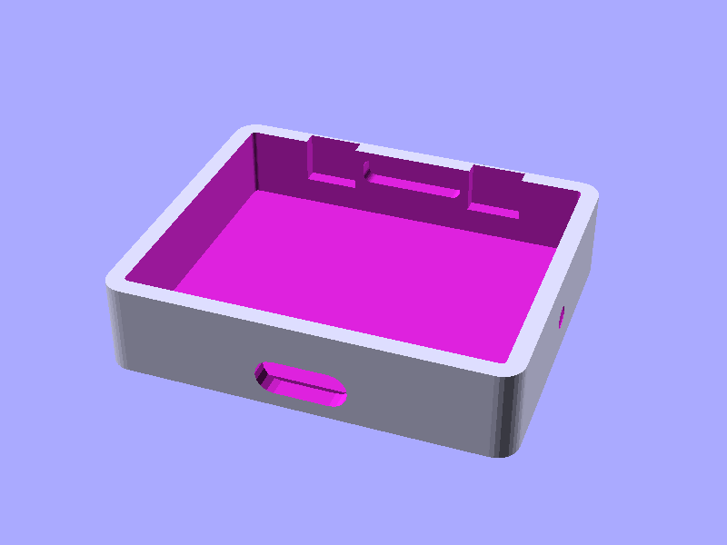

# ST7789 Dongle Cube Case

ST7789 1.69인치 디스플레이(가로 방향)와 나이스나노 v2를 위한 3D 프린트 케이스.  
A 3D-printable two-part snap-fit enclosure for the **ST7789 1.69" display** (landscape orientation) and **Nice!Nano v2**.

---

## 미리보기 / Preview

| 두 파트 / Both parts | 상단 쉘 / Top shell | 하단 쉘 / Bottom shell |
|:---:|:---:|:---:|
|  |  |  |

---

## 컴포넌트 치수 / Component Dimensions

| Component | Dimension | Source |
|-----------|-----------|--------|
| ST7789 1.69" PCB (landscape) | 39.0 × 31.5 mm | Waveshare 1.69" LCD Module |
| ST7789 active area (landscape) | 32.63 × 27.97 mm | Waveshare datasheet |
| Nice!Nano v2 PCB | 34.1 × 18.3 mm | Nice!Nano v2 spec |
| Nice!Nano v2 total height | 3.2 mm (incl. USB-C) | Nice!Nano v2 spec |

---

## 케이스 설계 / Case Design

### 구조 / Structure

The case splits into **two snap-fit shells**:

```
┌─────────────────────────────┐
│         TOP SHELL           │  ← 디스플레이 면 / display face
│   ┌───────────────────┐     │     landscape window cutout
│   │  display window   │     │     PCB ledge (display sits here)
│   └───────────────────┘     │     snap tongues on inner skirt
└─────────────────────────────┘
           ↕ snap-fit

┌─────────────────────────────┐
│        BOTTOM SHELL         │  ← 부품 수납 / electronics
│  ┌───────────────────────┐  │     Nice!Nano v2 mounting posts
│  │  Nice!Nano v2 seat    │  │     USB-C cutout (front wall)
│  └───────────────────────┘  │     LED window (right wall)
│   [USB-C]          [LED○]   │     wire pass-through (back wall)
└─────────────────────────────┘
```

### 외형 치수 / Outer Dimensions

| Dimension | Value |
|-----------|-------|
| Width  (W) | ≈ 47 mm |
| Height (H) | ≈ 39 mm |
| Depth  (D) | ≈ 16 mm (top + bottom assembled) |

### 특징 / Features

- **디스플레이 윈도우** – 32.63 × 27.97 mm (active area + tolerance) landscape cutout
- **PCB 레지** – Display PCB rests in a shallow pocket inside the top shell
- **스냅핏** – Two snap tabs per long side (no screws needed)
- **USB-C 슬롯** – Rounded slot on the front short wall for Nice!Nano charging/flashing
- **LED 창** – 2.5 mm circle on the right wall for the Nice!Nano power LED
- **배선 슬롯** – 12 × 3 mm slot on the back wall for wires

---

## 파일 / Files

```
case/
├── case.scad               # OpenSCAD parametric source (edit & export here)
├── preview_both.png        # Render: both parts
├── preview_top_shell.png   # Render: top shell
└── preview_bottom_shell.png# Render: bottom shell
```

---

## 출력 및 조립 / Printing & Assembly

### 슬라이서 설정 / Slicer Settings

| Setting | Value |
|---------|-------|
| Layer height | 0.2 mm |
| Infill | 15 % |
| Supports | **None required** |
| Top shell orientation | Face **DOWN** on build plate |
| Bottom shell orientation | Open side **UP** |

### STL 내보내기 / Exporting STL from OpenSCAD

```bash
# Install OpenSCAD: https://openscad.org/downloads.html

# Export top shell
openscad -D 'SHOW=1' -o top_shell.stl case/case.scad

# Export bottom shell
openscad -D 'SHOW=2' -o bottom_shell.stl case/case.scad
```

### 조립 순서 / Assembly Steps

1. **배선** – Wire the ST7789 to the Nice!Nano v2 (SPI: MOSI, SCLK, CS, DC, RST, 3V3, GND)
2. **디스플레이 장착** – Press the display PCB into the top-shell pocket from inside; the glass faces outward through the window
3. **나이스나노 장착** – Place the Nice!Nano v2 on the mounting posts in the bottom shell; USB-C port faces the front cutout
4. **배선 정리** – Route wires through the back slot; tuck excess into the cavity
5. **조립** – Press the two shells together until the snap tabs click

---

## 파라미터 커스터마이즈 / Customisation

Open `case/case.scad` in [OpenSCAD](https://openscad.org) and adjust the variables in the
`/* [Component Dimensions] */` and `/* [Case Parameters] */` sections at the top of the file
to fit your exact module variant.

Key parameters:

| Variable | Default | Description |
|----------|---------|-------------|
| `DISP_PCB_W` | 39.0 | Display PCB width (landscape) mm |
| `DISP_PCB_H` | 31.5 | Display PCB height (landscape) mm |
| `DISP_ACTIVE_W` | 32.63 | Active area width mm |
| `DISP_ACTIVE_H` | 27.97 | Active area height mm |
| `NN_W` | 34.1 | Nice!Nano PCB width mm |
| `NN_H` | 18.3 | Nice!Nano PCB height mm |
| `WALL` | 2.0 | Shell wall thickness mm |
| `TOLERANCE` | 0.25 | Fit clearance per side mm |

---

## 참고 / Reference

- [Simple Print Monitor – ST7789 1.54" Display Case (MakerWorld)](https://makerworld.com/de/models/2501721-simple-print-monitor-st7789-1-54-display-case)
- [Waveshare 1.69" LCD Module](https://www.waveshare.com/1.69inch-lcd-module.htm)
- [Nice!Nano v2 Documentation](https://nicekeyboards.com/nice-nano/)
